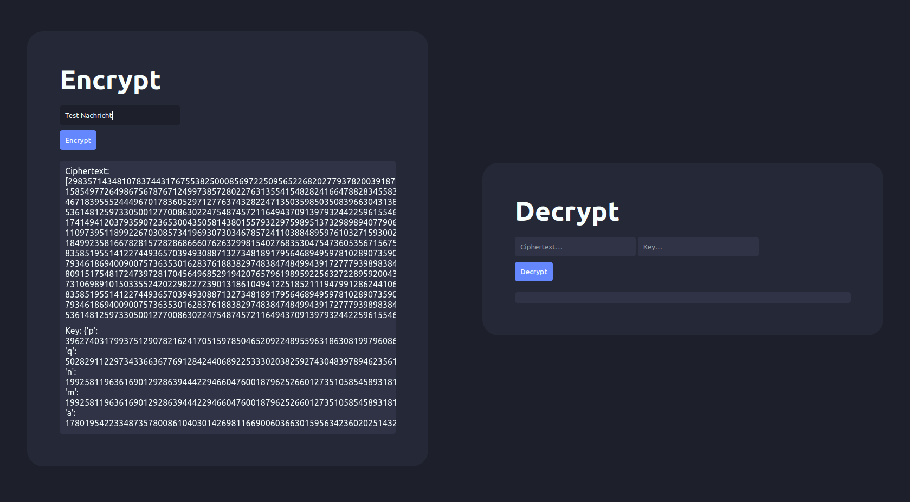

# Simples RSA Programm

#### Um die notwendigen Pakete zu installieren, muss der folgende Command in dem Projekt ausgeführt weden:
```
pip install -r requirements.txt
```
#
#### Um das Programm auszuführen muss lediglich die `main.py` Datei aufgerufen werden. Entweder über einen geeigneten Code Editor, oder über folgenden Command:
```
python3 main.py
```

#
### Nun ist das Programm auf der lokalen Website
### [http://127.0.0.1:5000/](http://127.0.0.1:5000/) oder <br> 
### [http://localhost:5000/](http://localhost:5000/) <br>
### zu finden.

# 
# Die Website:
#### Auf der Website können auf der linken Seite Texte verschlüsselt werden. Huer wird dann eine Liste mit Zahlen zurückgegeben. Diese Zahlen sind der verschlüsselte Text. <br> Ebenso ist darunter der Schlüssel als Dictionary zu finden. <br> <br> Beide Teile können dann auf der rechten Seite zum Entschlüsseln eingefügt weden. <br>
#### <br>
